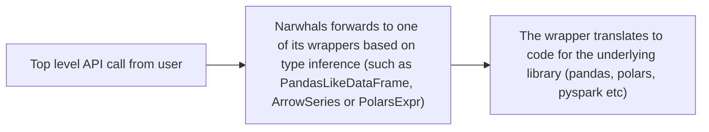
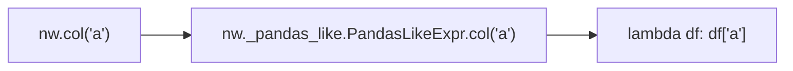

---
# You can also start simply with 'default'
theme: default
background: https://images.unsplash.com/photo-1484291470158-b8f8d608850d
title: Dataframe support with Narwhals
info: |
  Presentation on using Narwhals to develop dataframe libraries.
  Using Data Quality library of Wimsey as an example.
class: text-center
# https://sli.dev/features/drawing
drawings:
  persist: false
mdc: true
---

# 🐳
# Libraries for Any Dataframe

A guide to using Narwhals dataframe compatibility layer

*[(slides available on github)](https://github.com/benrutter/dataframe-support-with-narwhals)*

---

# About me

I am the person talking now

- 👋 My name is Ben
- 🐍 I've worked in data, mainly using Python for the last 5+ years
- ⚡ I'm the lead data engineer at Flexitricity
- 🌍 I love open source, especially dataframe engines, and have made contributions to:
  - 🟨🟧🟥 Dask (+ Dask-Databricks)
  - 🐳🦄🐳 Narwhals
  - 📂📁📂 FSSpec (ABFS/SSHFS)
- 🕵️ I'm currently working on a data testing project called Wimsey

---
layout: image-right
image: https://images.unsplash.com/photo-1696612464991-02c7e2d5d038
---

# My grand theory of data

There are two types of users of data
- Data producers
- Data victims

After multiple failed attempts at finding support groups for victims of unpredictable data sources, I discovered the joy of data contracts:

```yaml
- test: row_count_should
  be_exactly: 5
- column: first_name
  test: null_percentage_should
  be_exactly: 0
- column: rating
  test: max_should
  be_less_than_or_equal_to: 10
```
---

# A long time ago. . 

Difficulties of data testing with different dataframe engines

Testing dask data with great expectations requires computing/sampling:

```python
import dask.dataframe as dd

from somewhere_nearby import get_tests_to_run

some_gazillion_row_df = dd.read_parquet("../some/folder")
testable_df = gx.from_pandas(some_gazillion_row_df.sample(frac=0.01).compute())
results = testable_df.validate(expectation_suite=get_tests_to_run())
```

Wouldn't it be great if we could just give great-expectations any dataframe type we wanted?

...except that involves *a lot* of work.


---
layout: image-right
image: https://images.unsplash.com/photo-1658792726665-3c0fe0f27373
---

# Pre-Narwhals

Soda-core (amazing) manages to support *a lot* of dataframes, this is a pretty impressive feat, here's [a view of Soda's folder structure](https://github.com/sodadata/soda-core/tree/main/soda):

```
📂 soda
  📁 athena
  📁 atlan
  📁 bigquery
  📁 contracts
  📁 core
  📁 dask
  📁 db2
  📁 dbt
  📁 denodo
  📁 dreamio
  📁 duckdb
  ...
  📁 spark_df
  📁 sqlserver
  📁 teradat
  📁 trino
  📁 vertica

```

---
layout: image-left
image: https://images.unsplash.com/photo-1568430462989-44163eb1752f
---


# Then along came Narwhals. . .

The joy of just implementing things once

Narwhals handles all compatibility, so we just write (almost) polars code!

```python
import narwhals as nw
from narwhals.typing import FrameT


@nw.narwhalify
def func(df: FrameT) -> FrameT:
    return df.select(
        a_sum=nw.col("a").sum(),
        a_mean=nw.col("a").mean(),
        a_std=nw.col("a").std(),
    )
```
---

# Wimsey now
with Narwhals doing all the work


````md magic-move {lines: true}
```python {11,2|*}
import pandas as pd
from wimsey import validate

from settings import sleuth_storage_options

top_sleuth: str = (
  pd.read_csv(
    "sshfs://sleuthwatch/top-5-sleuths.csv",
    storage_options=sleuth_storage_options,
  )
  .pipe(validate, "sleuth-checks.json")  # <- this is the wimsey bit
  .assign(name=lambda df: df["first_name"] + df["last_name"])
  .sort_values("rating", ascending=False)
  ["name"][0]
)

print(f"{top_sleuth} is the best sleuth!")
```

```python
import polars as pl
from wimsey import validate

from settings import sleuth_storage_options

top_sleuth: str = (
  pl.read_csv(
    "sshfs://sleuthwatch/top-5-sleuths.csv",
    storage_options=storage_options,
  )
  .pipe(validate, "sleuth-checks.json")  # <- this is the wimsey bit
  .with_columns(name=pl.col("first_name") + " " + pl.col("last_name"))
  .sort("rating", descending=True)
  .select("name")
  .to_series()[0]
)

print(f"{top_sleuth} is the best sleuth!")
```

```python
import dask.dataframe as dd
from wimsey import validate

from settings import sleuth_storage_options

top_sleuth: str = (
  dd.read_csv(
    "sshfs://sleuthwatch/top-5-sleuths.csv",
    storage_options=sleuth_storage_options,
  )
  .pipe(validate, "sleuth-checks.json")  # <- this is the wimsey bit
  .assign(name=lambda df: df["first_name"] + " " + df["last_name"])
  .sort_values("rating", ascending=False)
  ["name"]
  .compute()[0]
)

print(f"{top_sleuth} is the best sleuth!")
```

````
---

# Narwhals supports a bunch of dataframes!
Currently supported dataframe engined

- 🐼 Pandas
- 🐻‍❄️ Polars
- 🎯 PyArrow
- 🔵 Modin
- 💜 CuDF
- 🟧 Dask

Upcoming:
- 🦆 DuckDB
- 🪿 Ibis
- ⚡ PySpark
---

# How does it work?
Underwater unicorn magic explained

Some examples of polars-style expressions:

```python
nw.col("a", "b").sum()

nw.sum_horizontal("a", "b")

nw.col("b") == 4
```

Which are evaluated within *contexts*:

```python
df.select(nw.col("a", "b").sum())

df.with_columns(c=nw.sum_horizontal("a", "b"))

df.filter(nw.col("b") == 4)
```
---

# How does it work?
Polars-style-expressions are essentially functions from a DataFrame to something else


We could think of these:
```python
nw.col("a", "b").sum()

nw.sum_horizontal("a", "b")

nw.col("b") == 4
```

As equivalent of these:

```python
def a_and_b_summed(df):
  return df.loc[:, "a"].sum(), df.loc[:, "b"].sum()

def sum_horizontal_a_b(df):
  return [df.loc[:, "a"] + df.loc[:, "b"]]

def b_is_four(df):
  return df.loc[:, "b"] == 4
```

---

# How does it work?

Narwhals implements a range of dataframe-style objects and "narwhals compliant namespaces" for each implementation.

When Narwhals executes a command, it takes:


Psuedo code example



---

# Final Example


```python
@nw.narwhalify
def describe(
    df: FrameT,
) -> dict[str, float]:
    """
    Outputs a dictionary for use in testing, mimicking polars 'describe' method.

    Note this code is adapted from polars own descrip function.
    """
    stat_cols = {c for c, dt in df.schema.items() if dt.is_numeric()}
    required_exprs: list = []
    required_exprs += [nw.col(c).mean().alias(f"mean_{c}") for c in stats_cols]
    required_exprs += [nw.col(c).std().alias(f"std_{c}") for c in stats_cols]
    df_metrics = df.select(*required_exprs)
    return {k: v[0] for k, v in df_metrics.to_dict(as_series=False).items()}
```

---

# Resources / Further Reading
